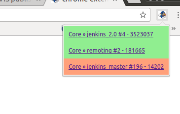

Jenkins Monitor Job Chrome Extension
--------------------------------

A chrome extension to monitor specific jenkins jobs

## Installation

For now, the process is manual.

 - download this project
 - go to settings - manage extensions
 - click on `developer mode`
 - load unpacked extension
 - load the project's folder

## Roadmap

 [ ] publish a zip artifact to install manually
 [ ] publish a crx file to install
 [ ] publish to chrome webstore
 [X] add ability to define 'links' to appear next to each job. (some places have tools that integrate with jenkins and it would be nice to jump right to them)

